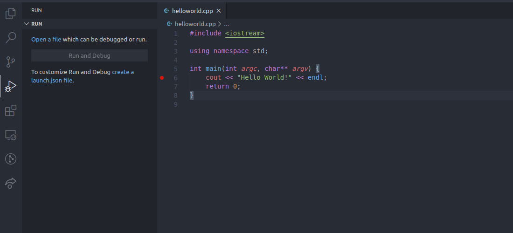

# vGDB | Visual Studio Code GDB Debug Adapter

A native typescript implementation of a debug adapter for GDB for use in Visual Studio Code. Tested on Linux, Windows support is untested. **This extension is under active development**

## Features

- Debugging on Linux (Windows and Mac support untested)
- Launch target in integrated Visual Studio Code terminal or external terminal
- Conditional breakpoints
- Debug Console prompt accepts native GDB commands
- Commands issued in the debug console will automatically pause and resume inferior process
- Honors deferred symbol loading settings in `.gdbinit`
- Support for lazy symbol loading as specified in launch configuration
- Support for setting environment variables
- Supports attach requests
- Supports remoteSSH

## Quick Start

vGDB ships with a sample launch configuration snippet you can use to quickly get started. Assuming your executable is named `a.out`, getting started is as easy as:

There is also a snippet for an attach request.

## Configuration

These are all of the settings currently supported:

### Launch Requests

| Configuration Option  | Required | Description                                                              |
| --------------------- |----------|--------------------------------------------------------------------------|
| `args`                | No       | Array of arguments to pass to debuggee                                   |
| `cwd`                 | No       | The directory in which to start GDB                                      |
| `debug`               | No       | Verbosity of logging. Values are `off`, `basic` or `verbose`             |
| `debugger`            | No       | Path to GDB executable                                                   |
| `env`                 | No       | Key value pairs of environment variables to set in debugging shell       |
| `externalConsole`     | No       | If set to false, debuggee will launch in Visual Studio Code terminal     |
| `program`             | Yes      | Path to program to debug                                                 |
| `sharedLibraries`     | No       | Array of shared library names to load, disregards all other libraries    |
| `startupCmds`         | No       | Array of GDB commands to run at start                                    |
| `useAbsoluteFilePaths`| No       | If true (default), full filepaths will be used when setting breakpoints  |

#### Additional Notes
- When using the `sharedLibraries` configuration setting, your `.gdbinit` setting for `auto-solib-add` will be overwritten to be `false`. The debug adapter will listen for shared library load events and only proceed to `sharedlibrary <name>` if that file is in your whitelist.
- When setting the `externalConsole` setting to `true`, hitting `CTRL+C` in the integrated terminal will not abort the debug target.
- The `startupCmds` commands will run after those in your `.gdbinit` file have run.

### Attach Requests

| Configuration Option  | Required | Description                                                              |
| --------------------- |----------|--------------------------------------------------------------------------|
| `debug`               | No       | Verbosity of logging. Values are `off`, `basic` or `verbose`             |
| `debugger`            | No       | Path to GDB executable                                                   |
| `program`             | Yes      | Path to program to debug                                                 |
| `useAbsoluteFilePaths`| No       | If true (default), full filepaths will be used when setting breakpoints  |